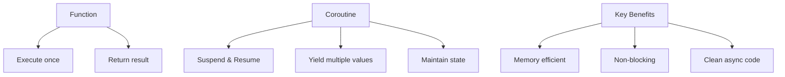
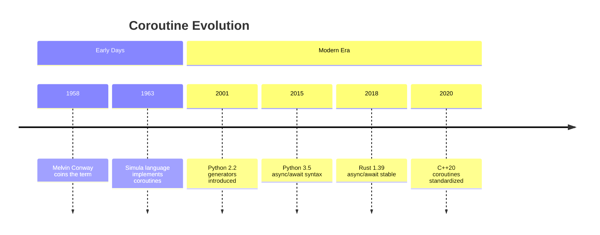
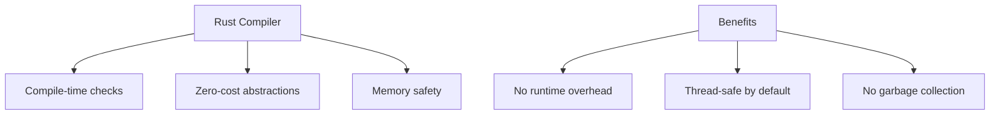
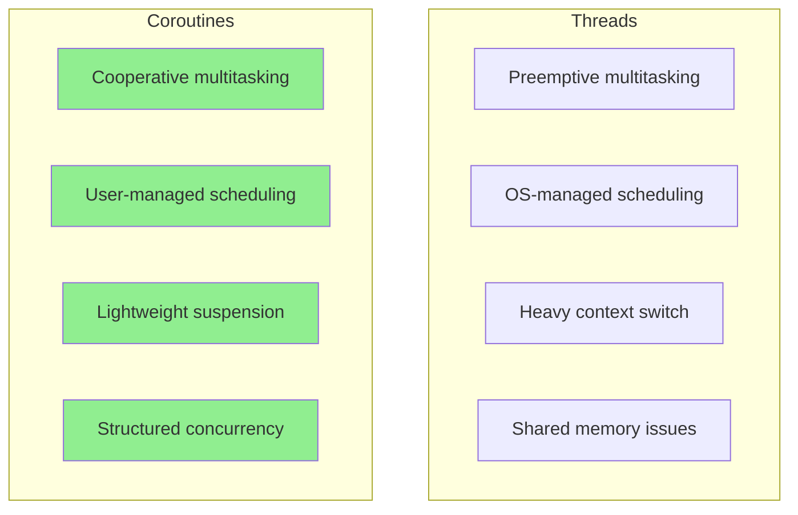
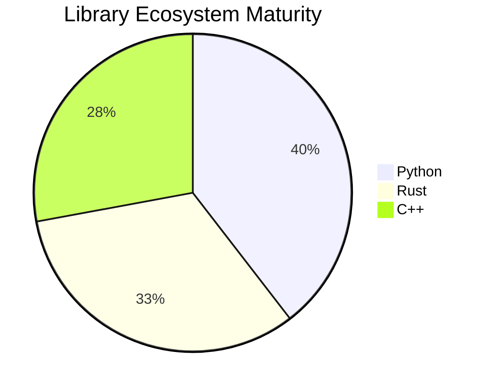
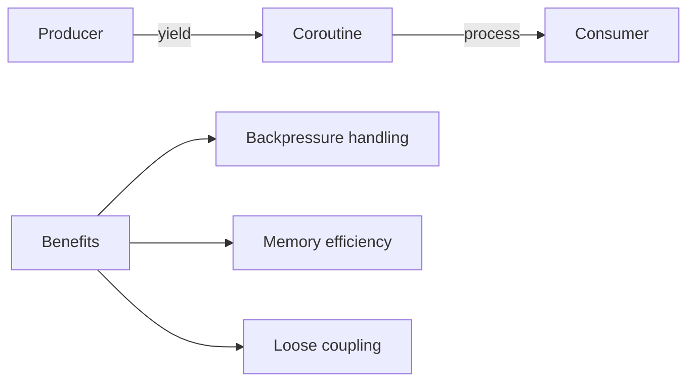
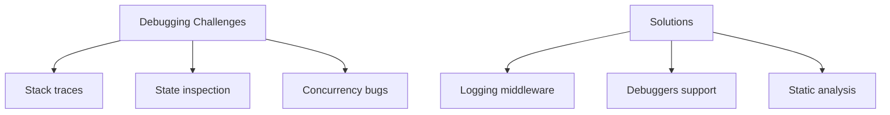
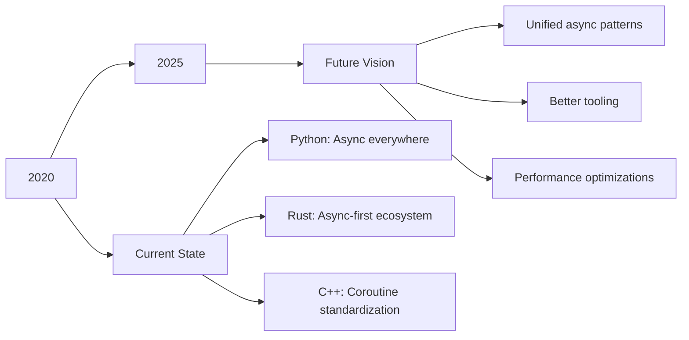

# Coroutines in Rust, Python, and modern C++: What, Why, and How

---

## 🎯 Overview

- **What** are coroutines? 🤔
- **Why** should we use them? ⚡
- **How** to implement them in different languages? 💻
- **Real-world examples** from our codebase 📚

---

## 📋 Agenda

1. **Introduction to Coroutines** (10 min)
   - Definition and basic concepts
   - Historical context and evolution

2. **Python Generators & Coroutines** (15 min)
   - Generators: The foundation
   - Async/await syntax
   - Real examples from `ec-gen`

3. **Rust's Async/Await** (15 min)
   - Future traits and Pin
   - Generator implementation
   - Examples from `rust_ai`

4. **Modern C++20 Coroutines** (15 min)
   - Coroutine concepts and co_await
   - Examples from `cpp_ai`
   - Performance considerations

5. **Comparison & Best Practices** (5 min)

---

## 🎪 What Are Coroutines?



**Coroutines are functions that can be paused and resumed** 🔄

- Unlike regular functions that run to completion
- Can yield multiple values over time
- Maintain internal state between suspensions
- Enable cooperative multitasking

---

## 📜 Historical Timeline



---

## 🐍 Python: Generators Foundation

### Basic Generator Pattern

```python
def simple_generator():
    """Python generator from src/ec_gen/combin.py"""
    yield 1
    yield 2
    yield 3

# Usage
for value in simple_generator():
    print(value)  # Prints: 1, 2, 3
```

### Real Example: Combination Generator

```python
def emk_comb_gen(n: int, k: int) -> Generator[tuple[int, int], None, None]:
    """Generate all combinations by homogeneous revolving-door
    
    From: src/ec_gen/combin.py:48
    """
    if k >= n or k <= 0:
        return
    if k == 1:
        for i in range(n - 1):
            yield (i, i + 1)
        return
    if k % 2 == 0:
        yield from emk_gen_even(n, k)
    else:
        yield from emk_gen_odd(n, k)
```

---

## 🐍 Python: Async/Await Evolution

### From Callbacks to Coroutines


### Modern Async Pattern

```python
import asyncio

async def fetch_data(url: str) -> str:
    """Modern Python coroutine"""
    async with aiohttp.ClientSession() as session:
        async with session.get(url) as response:
            return await response.text()

async def main():
    data = await fetch_data("https://api.example.com")
    print(data)

asyncio.run(main())
```

---

## 🐍 Python: Real-World Permutations

### Steinhaus-Johnson-Trotter Algorithm

```python
def sjt_gen(n: int) -> Generator[int, None, None]:
    """Generate all permutations using SJT algorithm
    
    From: src/ec_gen/sjt.py:25
    """
    if n == 2:
        yield 0
        yield 0  # tricky part: return to the origin
        return

    up = range(n - 1)
    down = range(n - 2, -1, -1)
    gen = sjt_gen(n - 1)
    for x in gen:
        for i in down:  # downward
            yield i
        yield x + 1
        for i in up:  # upward
            yield i
        yield next(gen)  # tricky part
```

**🎯 Key Insight**: Python generators use `yield` to create coroutines naturally!

---

## 🦀 Rust: Async/Await System

### Core Concepts

```rust
use genawaiter::{sync::gen, yield_};

pub fn emk_comb_gen(n: i32, k: i32) -> impl Iterator<Item = (i32, i32)> {
    gen!({
        if k >= n || k <= 0 {
            return;
        }
        if k == 1 {
            for i in 0..(n - 1) {
                yield_!((i, i + 1));
            }
            return;
        }
        // ... recursive logic
    })
    .into_iter()
}
```

From: `rust_ai/src/combin.rs:60`

---

## 🦀 Rust: Memory Safety + Performance

### Zero-Cost Abstractions



### Ehrlich-Hopcroft-Reingold Algorithm

```rust
pub fn ehr_gen(n: i32) -> impl Iterator<Item = i32> {
    gen!({
        if n < 2 {
            return;
        }

        let mut b: Vec<i32> = (0..n).collect();
        let mut c: Vec<i32> = vec![0; (n + 1) as usize];

        loop {
            let mut k = 1;
            loop {
                if c[k as usize] == k {
                    c[k as usize] = 0;
                    k += 1;
                }
                if c[k as usize] < k {
                    break;
                }
            }
            if k == n {
                break;
            }
            c[k as usize] += 1;
            yield_!(b[k as usize]);
            // ... state management
        }
    })
    .into_iter()
}
```

From: `rust_ai/src/ehr.rs:18`

---

## 🦀 Rust: Type System Power

### Compile-Time Guarantees

```rust
// Type-safe generator with lifetime management
pub fn emk<T: Clone>(n: i32, k: i32, zero: T, one: T) 
    -> impl Iterator<Item = Vec<T>> {
    gen!({
        let mut s = vec![one.clone(); k as usize];
        s.extend(vec![zero.clone(); (n - k) as usize]);
        yield_!(s.clone());

        for (x, y) in emk_comb_gen(n, k) {
            s.swap(x as usize, y as usize);
            yield_!(s.clone());
        }
    })
    .into_iter()
}
```

**🛡️ Rust Advantage**: Compile-time memory safety without performance penalties!

---

## 🚀 Modern C++20 Coroutines

### The C++ Approach

```cpp
#include <cppcoro/generator.hpp>

namespace ecgen {

auto sjt_gen(int n) -> cppcoro::generator<int> {
    if (n <= 1) {
        co_return;
    }
    
    // Stack-based recursion simulation
    struct frame {
        int n;
        int dir;
        int i;
    };
    
    std::stack<frame> stk;
    stk.push({n, -1, 0});
    
    while (!stk.empty()) {
        auto& f = stk.top();
        // ... coroutine logic
        co_yield swap_position;
    }
}

} // namespace ecgen
```

From: `cpp_ai/src/sjt.cpp`

---

## 🚀 C++: Template Metaprogramming

### Compile-Time Computation

```cpp
template <int N, int K> 
constexpr auto Combination() {
    if constexpr (K >= N || K == 0) {
        return std::integral_constant<size_t, 1U>{};
    } else {
        return std::integral_constant<size_t,
              Combination<N - 1, K - 1>() + Combination<N - 1, K>()>{};
    }
}
```

From: `cpp_ai/include/ecgen/combin.hpp:70`

### Generic Algorithm Application

```cpp
template<typename Container>
auto sjt_apply(int n, Container& container) 
    -> cppcoro::generator<Container&> {
    co_yield container;
    for (int swap_pos : sjt_gen(n)) {
        std::swap(container[swap_pos], container[swap_pos + 1]);
        co_yield container;
    }
}
```

---

## ⚡ Performance Comparison



```mermaid
gantt
    title Performance Characteristics
    dateFormat X
    axisFormat %s
    
    section Python
    Generator overhead    :0, 10
    GIL limitations       :0, 8
    
    section Rust
    Zero-cost abstractions :0, 2
    Memory safety          :0, 3
    
    section C++
    Template metaprogramming :0, 4
    Manual optimization     :0, 3
```

### Key Metrics

| Language | Memory Usage | Speed | Safety | Ease of Use |
|----------|-------------|-------|--------|-------------|
| Python   | High 📈     | Slow 🐌 | Medium 🟡 | Easy ✅ |
| Rust     | Low 📉     | Fast 🚀 | High ✅ | Medium 🟡 |
| C++      | Medium 🟡   | Fast 🚀 | Low 🔴 | Hard 🔴 |

---

## 🔄 Coroutines vs Threads



---

## 🎯 Real-World Use Cases

### 1. **Combinatorial Generation** 🎲
- Generate permutations/combinations
- Mathematical algorithms
- Our `ec-gen` project!

### 2. **I/O Operations** 🌐
- Network requests
- File operations
- Database queries

### 3. **Stream Processing** 📊
- Real-time data pipelines
- Event handling
- Reactive programming

---

## 🐍 Python: Best Practices

### ✅ Do's
```python
# ✅ Use generators for memory efficiency
def process_large_dataset(data):
    for item in data:
        yield process(item)

# ✅ Use async for I/O-bound operations
async def fetch_multiple_urls(urls):
    tasks = [fetch_url(url) for url in urls]
    return await asyncio.gather(*tasks)
```

### ❌ Don'ts
```python
# ❌ Don't use for CPU-bound operations
async def cpu_intensive():
    result = heavy_computation()  # Blocks event loop
    return result
```

---

## 🦀 Rust: Best Practices

### ✅ Do's
```rust
// ✅ Use async for I/O operations
async fn fetch_data(url: &str) -> Result<String, Error> {
    let response = reqwest::get(url).await?;
    response.text().await
}

// ✅ Use Pin for self-referential structs
use std::pin::Pin;

pub struct SelfReferential {
    data: String,
    pointer: *const u8,
}
```

### ❌ Don'ts
```rust
// ❌ Don't block async contexts
async fn bad_example() {
    std::thread::sleep(Duration::from_secs(1)); // Bad!
    tokio::time::sleep(Duration::from_secs(1)).await; // Good!
}
```

---

## 🚀 C++: Best Practices

### ✅ Do's
```cpp
// ✅ Use RAII with coroutines
auto coroutine_with_cleanup() -> cppcoro::task<> {
    auto resource = std::make_unique<Resource>();
    co_await async_operation();
    // Resource automatically cleaned up
}

// ✅ Use concepts for type safety
template<std::integral T>
auto factorial(T n) -> std::size_t {
    // Type-safe implementation
}
```

### ❌ Don'ts
```cpp
// ❌ Don't forget exception safety
auto dangerous_coroutine() -> cppcoro::task<> {
    risky_operation();  // May throw!
    co_return;  // Resource leak!
}
```

---

## 🌐 Ecosystem Comparison



### Available Libraries

| Language | Async Runtime | Web Framework | Database |
|----------|---------------|---------------|----------|
| Python   | asyncio, trio | FastAPI, aiohttp | asyncpg, aiomysql |
| Rust     | tokio, async-std | axum, warp | sqlx, diesel |
| C++      | cppcoro, folly | crow, pistache | soci, odb |

---

## 🏗️ Architecture Patterns

### Producer-Consumer Pattern



### Implementation Examples

**Python:**
```python
def producer():
    for item in data_source:
        yield item

async def consumer(generator):
    async for item in generator:
        await process(item)
```

**Rust:**
```rust
async fn producer() -> impl Stream<Item = Data> {
    // Stream implementation
}

async fn consumer(mut stream: impl Stream<Item = Data>) {
    while let Some(item) = stream.next().await {
        process(item).await;
    }
}
```

---

## 🔍 Debugging Coroutines

### Common Challenges



### Language-Specific Tools

**Python:**
```python
import asyncio
import logging

async def debugged_coroutine():
    logger = logging.getLogger(__name__)
    logger.info("Starting coroutine")
    try:
        result = await some_operation()
        logger.info(f"Result: {result}")
    except Exception as e:
        logger.error(f"Error: {e}")
        raise
```

**Rust:**
```rust
use tracing::{info, error, instrument};

#[instrument]
async fn debugged_coroutine() -> Result<(), Error> {
    info!("Starting coroutine");
    match some_operation().await {
        Ok(result) => {
            info!("Result: {:?}", result);
            Ok(())
        }
        Err(e) => {
            error!("Error: {:?}", e);
            Err(e)
        }
    }
}
```

---

## 🚀 Future Trends

### Language Evolution



### Emerging Technologies

- **Structured Concurrency**: Better error handling and cancellation
- **Effect Systems**: Compile-time effect tracking
- **Coroutine Transpilation**: Cross-language compatibility
- **Zero-Cost Abstractions**: Performance without complexity

---

## 📚 Resources & References

### 📖 Books
- "Async Programming in Rust" by Steve Clarke
- "Python Concurrency with asyncio" by Matthew Fowler
- "C++20: The Complete Guide" by Nicolai Josuttis

### 🌐 Online Resources
- [Python asyncio documentation](https://docs.python.org/3/library/asyncio.html)
- [Rust async book](https://rust-lang.github.io/async-book/)
- [C++20 coroutines reference](https://en.cppreference.com/w/cpp/language/coroutine)

### 🛠️ Our Codebase Examples
- `src/ec_gen/` - Python generators
- `rust_ai/src/` - Rust async implementations  
- `cpp_ai/src/` - C++20 coroutines

---

## 🎯 Key Takeaways

1. **Coroutines enable efficient, non-blocking code** 🚀
2. **Each language has unique strengths**:
   - Python: Easiest to use, great ecosystem
   - Rust: Safest and fastest, steeper learning curve
   - C++: Most control, highest complexity
3. **Choose based on your requirements**:
   - Rapid development → Python
   - Performance & safety → Rust
   - Low-level control → C++

---

## 🙋 Q&A

### Discussion Points
- What are your coroutine use cases?
- Which language fits your project best?
- What challenges have you faced?

### Contact
- Repository: `github.com/luk036/ec-gen`
- Examples in: `src/`, `rust_ai/`, `cpp_ai/`

---

# Thank You! 🎉

**Happy Coroutine Coding!** 💻✨